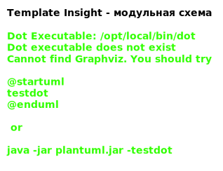
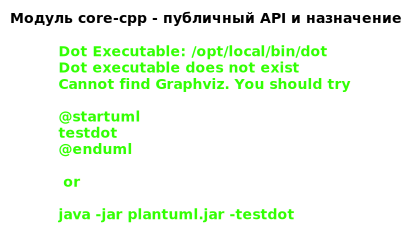
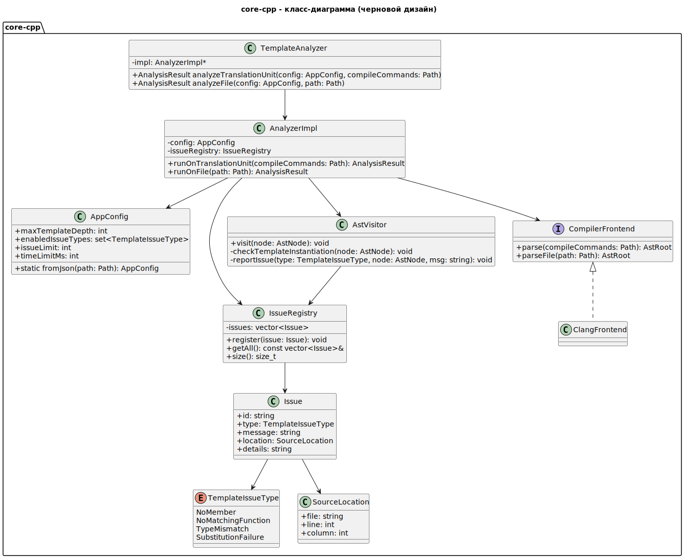

# template-insight-plugin
CLion plugin for C++ template analysis and visualization

## Архитектура Template Insight

### Модульное взаимодействие

### Модуль core-cpp – API

### Диаграмма классов core-cpp

